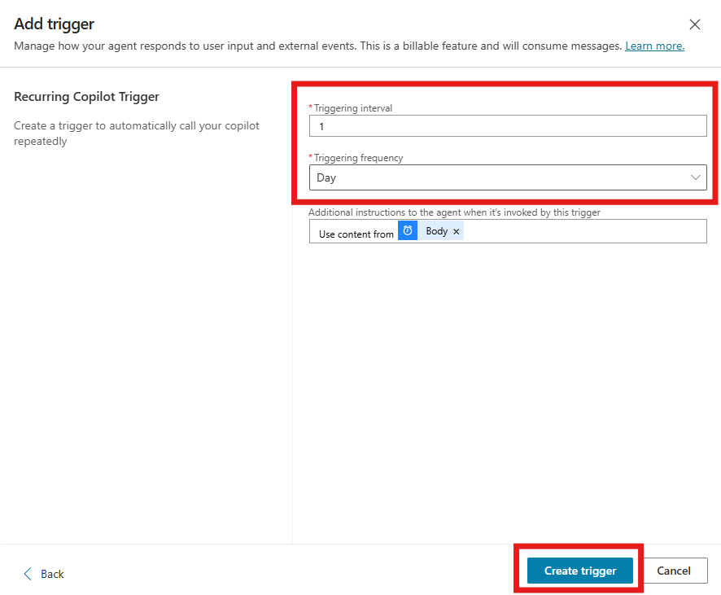

# 🧪 Lab: Adding a Recurrence Trigger in Copilot Studio

## Objective

Learn how to create a Custom Agent in Copilot Studio and configure a recurrence trigger to automate actions on a schedule.

### 🧭 Step 1: Access Copilot Studio

1. Open your browser and go to https://copilotstudio.microsoft.com.
2. Sign in with your Microsoft credentials if prompted.

### 🧱 Step 2: Create a New Custom Agent

1. In the left-hand navigation pane, click on Agents.
2. Click the + New agent button in the main panel.


### 🧱 Step 3: Skip Natural Language Setup

1. After clicking + New agent, you’ll be taken to the “Start building your agent” screen.
2. Instead of describing your agent in natural language, click the Configure button (highlighted in red in the screenshot).


This will take you directly to the manual configuration settings, allowing you to define your agent’s behavior and triggers more precisely.

### 🧱 Step 4: Fill in Agent Details

1. In the Configure view, fill out the following fields:

   - Name: Excel Agent
   - Description: This agent helps to answer questions related to the product catalog.
   - Instructions: Use the excel files from knowledge to respond to user inquiries. For instance, what is the total price of the products of the category Smartphone?

   

These fields define the agent’s purpose and guide its behavior when interacting with users.

### 🧱 Step 5: Agent Overview Page

Once your agent is created, you’ll land on the Agent Overview page.

Here’s what you’ll see:

- ✅ A confirmation message: “Your agent is ready!”
- 🛠 Suggestions for next steps:
  - Add tools so your agent can perform actions.
  - Add triggers to activate your agent based on events.
  - Publish and share your agent when it’s ready.

You’ll also have access to the following configuration sections:

- Details: Displays the agent’s name and description.
- Orchestration: Toggle generative AI orchestration on or off.
- Instructions: Shows the guidance you provided for how the agent should behave.


This is your central hub for managing and evolving your agent.

### 🧱 Step 6: Add a Trigger

1. Scroll down on the agent overview page until you find the Triggers section.
2. Click the Add trigger button (highlighted in red in the screenshot).


This will allow you to define how and when your agent should be activated—such as on a schedule, via an event, or through user interaction.

### 🧱 Step 7: Select a Recurrence Trigger

1. In the Add trigger screen, you’ll see several trigger types.
2. Click on Recurrence (highlighted in red) to set up a trigger that runs on a scheduled basis—such as daily, weekly, or at custom intervals.
3. Once selected, click the Next button in the bottom-right corner to proceed with configuring the recurrence details.


### 🧱 Step 8: Name the Trigger

1. In the Add trigger screen, enter a name for your trigger.

-  Recurring Copilot Trigger for Catalog Value Unset or Unknown Notification

   
2. This name helps identify the purpose of the trigger within your agent’s configuration.
3. Once the name is entered, click the Next button in the bottom-right corner to proceed.


### 🧱 Step 9: Set the Recurrence Schedule

1. In the Recurrence settings screen:

- Set the Triggering interval to 1
- Set the Triggering frequency to Day
- This means the trigger will run once every day.

2. Optionally, you can add instructions or content to the body if needed.

3. Once configured, click the Create trigger button in the bottom-right corner to finalize the setup.



### 🧱 Step 10: Wait for Trigger Creation

After clicking Create trigger, you’ll see a loading screen with the message:

“Adding your trigger. This might take a few seconds.”


1. Just wait a moment while Copilot Studio finalizes the setup. Once complete, your recurrence trigger will be active and visible in the agent’s Triggers section.

After a few seconds, you’ll see a confirmation message:

“Your trigger was successfully added. Now, test to make sure it is working properly.”


2. Click Close to return to the agent overview page.

### 🧱 Step 11: View and Manage Your Trigger

1. Once the trigger is successfully created, it will appear in the Triggers section of your agent’s overview page.

2. Click on the trigger name — in this case, Recurring Copilot Trigger for Product Catalog Notification — to view or edit its configuration.


From here, you can adjust the schedule, update the logic, or delete the trigger if needed.

---

### 🧱 Step 12: Build the Flow in Power Automate

After clicking on the trigger name (Recurring Copilot Trigger for Product Catalog Notification), you’ll be redirected to Power Automate, where you can define the logic that runs when the trigger fires.

You’ll see a flow canvas with the Recurrence trigger already in place.

The goal of this flow is to:

- Read an Excel file containing a product catalog.
- Extract specific items from the file (e.g., products in a certain category).
- Send an email with:
  - Selected items included in the email body.
  - The full Excel file attached.


We’ll walk through each step of building this flow in the next part of the lab.

### 🧱 Step 13: Add Excel Data Retrieval to the Flow

1. In Power Automate, click the ➕ icon just below the Recurrence step to add a new action.
2. In the Add an action panel, use the search bar to look for:
List rows present in a table
3. From the search results, select the action under Excel Online (Business) labeled List rows present in a table (highlighted in the screenshot).


This action will allow the flow to read data from a table inside an Excel file stored in OneDrive or SharePoint.

### 🧱 Step 14: Configure Excel Connector Fields
Now that you've added the List rows present in a table action, it’s time to connect it to your Excel file stored in SharePoint.

1. Fill in the connector fields as follows:

  - Location: Select your SharePoint site.
  - Document Library: Documents
  - File: /ElectronicProducts.xlsx
  - Table: Table1

    
  
This configuration tells Power Automate where to find the Excel file and which table to read data from.


### 🧱 Step 15: Filter Excel Data by Category
To ensure the flow only processes relevant data, we’ll apply a filter to retrieve only products without category.

1. In the List rows present in a table action, expand the Advanced options (if not already visible).
2. Select Filter Query.

     
   
3. In the Filter Query field, enter the following expression:

> ProductCategory eq ''

This ensures that it will be only returned rows where the ProductCategory column is not defined.

     
  
This step is crucial for narrowing down the dataset before sending it to Copilot or including it in an email.

     


### 🧱 Step 16: Add a Select Action to Format Output
To clean up and rename the data fields from the Excel table before sending them in an email or to Copilot, we’ll use the Select action.

1. Click the ➕ icon below the List rows present in a table step.
2. In the Add an action panel, search for Select.
3. Under the Data Operation category, click on the Select action (highlighted in red in the screenshot).

     
   
This action allows you to:

- Choose only the columns you want to include.
- Rename the headers to more user-friendly labels.

In the next step, we’ll configure the From field and map the headers.


### 🧱 Step 17: Configure the Select Action to Map and Rename Headers

Now that you've added the Select action, let’s configure it to clean up the output from the Excel table.

1. In the Select action:
   - Click into the From field.
   - Type a forward slash / or click on the lightning bolt icon (⚡) to open the dynamic content panel.
   - From the List rows present in a table section, choose value or body (depending on how it's labeled in your flow).

This connects the Select action to the filtered rows from your Excel file.

  

Once connected, you’ll be able to define which columns to include and how to rename them in the Map section below.

2. In the Map section of the Select action, define the fields you want to include and rename them for clarity:

  - Click + Add row.
  - In the left column, type the new label:
    
    - Product Description

    - In the right column, select the dynamic content that corresponds to the product name or description.
  
      
    
  - Add another row. In the left column, type:
    - Product Price
    - In the right column, select the dynamic content for the product price.
  
    

### 🧱 Step 18: Create an HTML Table from the Filtered Data

To display the selected product information in a clean, readable format within the body of an email, we’ll convert the mapped data into an HTML table.

1. Click the ➕ icon below the Select action to add a new step.

2. In the Add an action panel, search for Create HTML table.

3. Select the Create HTML table action under the Data Operations category.

4. Configure the action:

  - In the From field, select the output of the Select action (you can type / or click the ⚡ icon to open dynamic content and choose the output from Select).
   
  - Leave the Columns option set to Automatic unless you want to manually define the column order and names.
  
  

This step will generate an HTML-formatted table from the filtered and renamed Excel data, which can be embedded directly into the body of an email.

### Step 19: Connect the Select Output to the HTML Table

Now that you've added the Create HTML table action, you need to specify the data source for the table.

1. In the From field of the Create HTML table action:

  - Click into the field and either type / or click the lightning bolt icon (⚡) to open the dynamic content panel.

  - From the list of available outputs, select Output from the Select step (highlighted in the screenshot).
  
  
  
This ensures that the HTML table is built using the filtered and renamed data you prepared earlier.


### 🧱 Step 20: Add a Compose Action to Format the HTML Table

By default, the Create HTML table action generates a plain, unstyled table. 


To improve its appearance in the email, we’ll use a Compose action to wrap the table in custom HTML styling.

1. Click the ➕ icon below the Create HTML table step to add a new action.

2. In the Add an action panel, search for Compose.

3. Select the Compose action under the Data Operation category (highlighted in the screenshot).

   

4. In the Inputs field of the Compose action, enter the following HTML structure:

    ```html
    <style>
    table {
      border: 1px solid #1C6EA4;
      background-color: #EEEEEE;
      width: 100%;
      text-align: left;
      border-collapse: collapse;
    }
    table td, table th {
      border: 1px solid #AAAAAA;
      padding: 3px 2px;
    }
    table tbody td {
      font-size: 13px;
    }
    table thead {
      background: #1C6EA4;
      border-bottom: 2px solid #444444;
    }
    table thead th {
      font-size: 15px;
      font-weight: bold;
      color: #FFFFFF;
      border-left: 2px solid #D0E4F5;
    }
    table thead th:first-child {
      border-left: none;
    }
    </style>
    ```

   

This step ensures that the table will be styled with borders, padding, and a header background when rendered in the email body.

### 🧱 Step 21: Add the Office 365 Outlook – Send an Email (V2) Action

To notify stakeholders about the products with missing catalog values, we’ll send an email using the Office 365 Outlook – Send an email (V2) connector.

1. Click the ➕ icon below the Compose step to add a new action.
2. In the Add an action panel, search for: Outlook send an email

3. From the list of results, select Send an email (V2) under the Office 365 Outlook connector.

   
   
This action will allow you to:

- Define recipients
- Add a subject line
- Include the formatted HTML table in the email body
- Attach the original Excel file if needed

In the next step, we’ll configure the email content and attachment.

### 🧱 Step 22: Configure the Email Notification

Now that the Send an email (V2) action is added, let’s configure it to notify the appropriate recipient with the formatted product catalog data.

1. Fill in the fields as follows:

- To: Amber Rodriguez
(You can select the contact from your directory or type the email address directly.)

- Subject:
Notification: Products with Missing Catalog Values

- Body:

    ```
    Dear Amber,
    
    This is an automated notification to inform you that the following products in our catalog are missing category information.
    
    @{outputs('Compose')}
    @{body('Create_HTML_table')}
    
    Please review and update the missing catalog values at your earliest convenience to ensure our product catalog remains accurate and up to date. If you have any questions or need assistance, feel free to reach out.
    
    Thank you for your attention to this matter!
    
    ```

2. Explanation of dynamic values:

- **@{outputs('Compose')}:** This inserts the styled HTML wrapper created in the Compose step, ensuring the table looks clean and professional.

- **@{body('Create_HTML_table')}:** This inserts the actual table content generated from the Create HTML table step.


   
 
These dynamic values are pulled from earlier steps in your flow and will render a styled table directly in the email body.

### 🧱 Step 23: Test Your Flow

Now that your flow is fully built, it’s time to test it and make sure everything works as expected.

1. At the top of the Power Automate designer, click Save draft to ensure all your changes are stored.
2. Click the Test button.
3. In the Test Flow panel that appears on the right:
  - Select Manually to trigger the flow yourself.
  - Then click Publish & Test to publish the flow and prepare it for execution.

    

4. Once the flow is published, click Run flow to start the process.

   

This will execute the recurrence trigger immediately, retrieve and filter the Excel data, format it, and send the notification email.

5. Click Done to close the Run flow panel.
   
   

You’ll be redirected to the Flow run summary page.

Here, you can review the status of each step in your flow.
- ✅ Green check icon: Indicates the step ran successfully.
- ❌ Error icon: Indicates the step encountered an issue and needs troubleshooting.

In the expected result shown, all steps—including Recurrence, List rows present in a table, Select, Create HTML table, Compose, Send an email (V2), and Send a prompt to the specified copilot—have completed successfully, each marked with a green check.


This confirms that your flow is working as intended!

6. Navigate to Amber Rodriguez’s inbox (or the inbox of the recipient you configured in the Send an email (V2) step).

6. Look for an email with the subject:
Notification: Products with Missing Catalog Values

7. Open the email and verify that:
- The message body includes the styled HTML table with product data.
- The formatting appears as expected.

This final step ensures that the flow not only executed correctly but also delivered the intended output to the recipient.


### 🧱 Step 24: Review Trigger Run History

After confirming that the flow executed successfully and the email was delivered as expected:

1. Return to Copilot Studio.

2. In your agent’s Triggers section, locate the trigger you created — for example:
Recurring Copilot Trigger for Product Catalog Notification

3. Click on the trigger name to open its details.

   
   
   
4. You’ll be redirected to the associated Power Automate flow.
Click Back to return to the flow overview page where you can access the Flow settings and Run history.

   


5. In the Run history section, you can view past executions of the trigger.

   
  

6. Click on any event to see detailed information about its status and execution steps.

   
    
This allows you to verify whether the trigger has been running as expected and troubleshoot any issues if needed.

